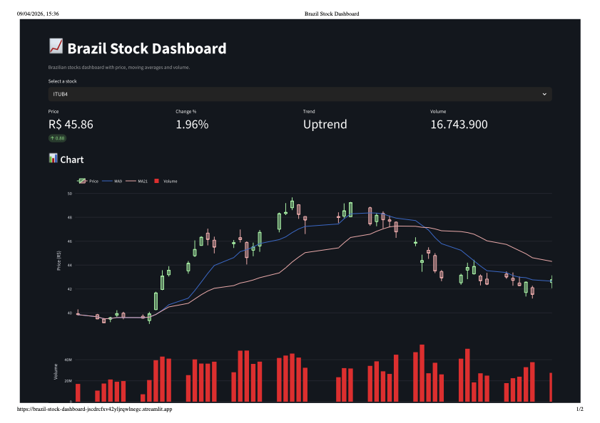

# 📊 Brazil Stock Dashboard

A **Data Engineering project** focused on Brazilian stock market (B3) data, featuring a complete ETL pipeline and an interactive dashboard.

---

## 🚀 Overview

This project demonstrates an end-to-end data pipeline:

* 📥 Data ingestion from a market API
* 🔄 Data transformation using Pandas
* 🗄️ Data storage in PostgreSQL
* 📊 Interactive visualization with Streamlit

---

## 🖼️ Dashboard Preview

### 📈 Overview



### 📊 Price Chart with Moving Averages


> 💡 *Replace these images with real screenshots from your dashboard for best results.*

---

## ⚙️ Features

* Fetches Brazilian stock data (PETR4, VALE3, ITUB4)
* Calculates technical indicators:

  * Moving Average (MA9)
  * Moving Average (MA21)
* Trend classification:

  * 📈 Uptrend
  * 📉 Downtrend
* Interactive dashboard
* Asset selection filter
* Historical price visualization

---

## 🧱 Architecture

```text
API (Brapi)
   ↓
Ingestion (fetch_data.py)
   ↓
Transformation (transform_data.py)
   ↓
PostgreSQL (stock_prices)
   ↓
Streamlit Dashboard
```

---

## 🛠️ Tech Stack

* Python
* Pandas
* PostgreSQL
* SQLAlchemy
* Streamlit

---

## 📂 Project Structure

```text
brazil-stock-dashboard/
│
├── app/
│   └── dashboard.py
│
├── scripts/
│   ├── fetch_data.py
│   ├── transform_data.py
│   └── load_data.py
│
├── config/
│   └── settings.py
│
├── sql/
│   └── create_tables.sql
│
├── images/
│   ├── dashboard.png
│   └── chart.png
│
├── requirements.txt
├── .gitignore
└── README.md
```

---

## ▶️ How to Run

### 1. Create a virtual environment

```bash
python3 -m venv venv
source venv/bin/activate
```

### 2. Install dependencies

```bash
pip install -r requirements.txt
```

### 3. Create PostgreSQL database

```sql
CREATE DATABASE stocks_db;
```

### 4. Run the pipeline

```bash
PYTHONPATH=. python scripts/load_data.py
```

### 5. Launch the dashboard

```bash
PYTHONPATH=. streamlit run app/dashboard.py
```

---

## ⚠️ Notes

* Data may differ from other platforms due to:

  * market data delays
  * data source differences
  * update frequency
  * rounding methods

---

## 💡 Future Improvements

* Demo trading simulator (paper trading)
* Advanced charts with Plotly
* Real-time data updates
* Cloud deployment (Streamlit Cloud)
* Additional technical indicators

---

## 👨‍💻 Author

This project was developed as part of a **Data Engineering learning journey**, focusing on building real-world pipelines and data-driven applications.


# 📊 Brazil Stock Dashboard

Projeto de **Engenharia de Dados** com dados da bolsa brasileira (B3), incluindo pipeline ETL completo e dashboard interativo.

---

## 🚀 Visão Geral

Este projeto demonstra a construção de um pipeline de dados de ponta a ponta:

* 📥 Ingestão de dados de mercado (API)
* 🔄 Transformação com Pandas
* 🗄️ Armazenamento em PostgreSQL
* 📊 Visualização com Streamlit

---

## 🖼️ Preview do Dashboard

### 📈 Visão Geral


### 📊 Gráfico com Médias Móveis


> 💡 *Adicione screenshots reais depois para deixar o projeto ainda mais profissional*

---

## ⚙️ Funcionalidades

* Coleta de dados de ações brasileiras (PETR4, VALE3, ITUB4)
* Cálculo de indicadores:

  * Média móvel (MA9)
  * Média móvel (MA21)
* Classificação de tendência:

  * 📈 Alta
  * 📉 Baixa
* Dashboard interativo
* Filtro por ativo
* Visualização de histórico de preços

---

## 🧱 Arquitetura do Projeto

```
API (Brapi)
   ↓
Ingestão (fetch_data.py)
   ↓
Transformação (transform_data.py)
   ↓
PostgreSQL (stock_prices)
   ↓
Streamlit Dashboard
```

---

## 🛠️ Tecnologias Utilizadas

* Python
* Pandas
* PostgreSQL
* SQLAlchemy
* Streamlit

---

## 📂 Estrutura do Projeto

```
brazil-stock-dashboard/
│
├── app/
│   └── dashboard.py
│
├── scripts/
│   ├── fetch_data.py
│   ├── transform_data.py
│   └── load_data.py
│
├── config/
│   └── settings.py
│
├── sql/
│   └── create_tables.sql
│
├── requirements.txt
├── .gitignore
└── README.md
```

---

## ▶️ Como Executar

### 1. Criar ambiente virtual

```bash
python3 -m venv venv
source venv/bin/activate
```

### 2. Instalar dependências

```bash
pip install -r requirements.txt
```

### 3. Criar banco PostgreSQL

```sql
CREATE DATABASE stocks_db;
```

### 4. Executar pipeline

```bash
PYTHONPATH=. python scripts/load_data.py
```

### 5. Rodar dashboard

```bash
PYTHONPATH=. streamlit run app/dashboard.py
```

---

## ⚠️ Observações

* Os dados podem apresentar diferenças em relação a outras plataformas devido a:

  * atraso de mercado
  * fonte de dados
  * horário de atualização
  * arredondamento

---

## 💡 Próximas melhorias

* Simulador de trading DEMO
* Gráficos com Plotly
* Deploy online (Streamlit Cloud)
* Atualização automática de dados
* Mais indicadores técnicos

---

## 👨‍💻 Autor

Projeto desenvolvido como parte do aprendizado em **Engenharia de Dados**.
